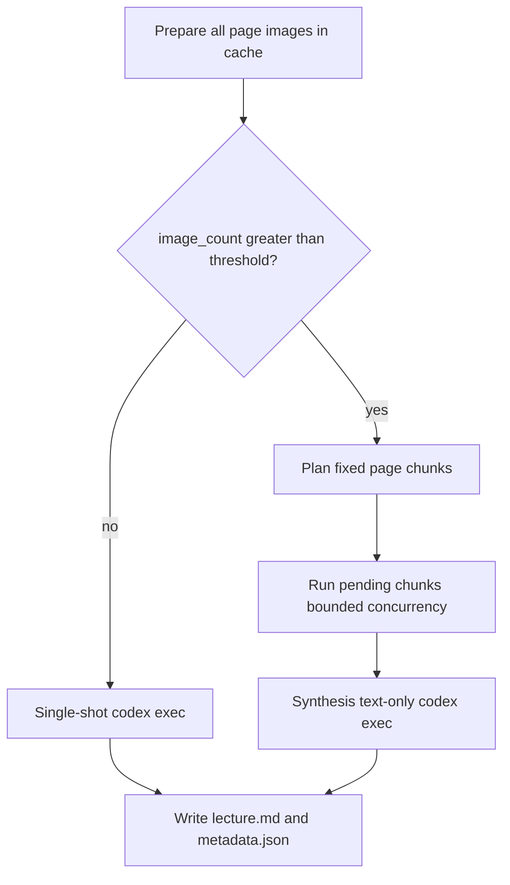

# Arbor: Large-PDF Chunked Generate — Design

**Date:** 2026-08-06
**Status:** Approved (design)
**Issue:** [#2 Process large PDFs in bounded concurrent chunks, then synthesize the lecture digest](https://github.com/MrF1ow/Arbor/issues/2)
**Category:** Worker pipeline enhancement (see `PROJECT.md`, `docs/superpowers/specs/2026-08-02-arbor-v1-design.md`)

## Problem

Arbor renders every PDF page to an image and sends all images in a single
`codex exec` request. A 129-page lecture produced ~255 MB of rendered images and
stayed in generation for 16+ minutes with no incremental output. Cancellation is
only checked between lectures, so it cannot stop an active large-PDF request, and
a failure loses all in-progress work.

This affects both image-based prepare paths: `pdf_images` and
`pptx_images_fallback` (the LibreOffice fallback for thin-text decks).

## Goals

- Faster, more predictable large-PDF processing.
- Visible per-chunk progress and useful resumability.
- Effective cancellation that keeps completed work.
- Final coherence via a synthesis pass over chunk digests (not unmerged chunks).
- Keep existing final artifacts: `lecture.md` and `metadata.json`.

## Non-goals (this change)

- Settings UI for chunk knobs — **explicitly deferred to V2** (heavier UI pass).
- Lazy per-chunk page rendering (prepare still renders all pages up front).
- Outline/bookmark-aligned splits (fixed page windows only).
- Automatic per-chunk retry loops.
- Any desktop layout change beyond surfacing new JSONL log events.

## Locked decisions

| Decision | Value |
|----------|-------|
| Split strategy | Fixed page windows |
| Trigger | `len(image_paths) > pdf_chunk_threshold_pages` (default 25) |
| Chunk size | `pdf_chunk_size_pages` (default 25) |
| Concurrency | `pdf_chunk_concurrency` (default 2) |
| Applies to | `pdf_images` and `pptx_images_fallback` |
| Text PPTX (`pptx_text`) | Unchanged single-shot |
| Small image lectures (`<= 25`) | Unchanged single-shot |
| Chunk failure | Mark chunk `failed`, stop scheduling, drain in-flight, fail lecture generate; keep `ok` chunk digests for resume |
| Synthesis failure | Do not write `lecture.md`/`metadata.json`; persist synth error; next Update retries synthesis only |
| Cancel granularity | Between chunk scheduling/completions and before synthesis; in-flight chunk may finish and be saved `ok` |
| Progress surface | New JSONL events in the existing desktop log (no UI redesign) |

## Architecture

Prepare is unchanged. The generate stage in
[`python/src/arbor_worker/pipeline.py`](../../../python/src/arbor_worker/pipeline.py)
chooses single-shot vs chunked based on image count, then delegates chunked work
to a dedicated module.

## Components

### Chunk planner
Pure function: given ordered image paths and chunk size, produce ordered chunk
descriptors with 1-based `page_start`/`page_end`, zero-padded `chunk_id`, and the
image slice for each chunk.

### Chunk manifest (cache)
Under `_arbor_cache/<source_hash>/`:

- `chunks.json` — manifest (chunk size, page count, model, per-chunk status,
  synthesis status).
- `chunk-NNNN.md` — per-chunk digest, written only when that chunk is `ok`.

A chunk is **done** only when `status == "ok"` and its `chunk-NNNN.md` exists and
is non-empty. The manifest is rebuilt if missing or if the plan (chunk size /
page count / model) changed; digests for chunks still valid are preserved.

### Chunk runner
Bounded-concurrency executor (thread pool, `max_workers = concurrency`). Runs only
`pending`/`failed` chunks. Checks cancellation between scheduling and on
completion. On chunk failure: record `failed` + error, stop scheduling new chunks,
let in-flight finish (saved if they succeed), then fail the lecture generate stage.

### Synthesizer
Runs only when every chunk is `ok`. One text-only `codex exec` (no images) whose
prompt contains the ordered chunk digests. Output must pass the same
`validate_digest` checks as today's `lecture.md`. On success, its markdown is what
Write persists. On failure, record synthesis error in the manifest and emit a
clear event; do not write artifacts; next Update retries synthesis only.

### Shared error util
New `python/src/arbor_worker/errors.py` with stable error codes and a helper that
emits a consistent failure payload through the `EventEmitter`. Chunk runner,
synthesizer, and pipeline route failures through it instead of ad-hoc strings, so
there is one place to add/adjust error semantics.

## Events (JSONL)

New event types on the existing stream:

| type | key fields |
|------|-----------|
| `chunk_started` | `lecture_dir`, `chunk_id`, `page_start`, `page_end`, `index`, `total` |
| `chunk_done` | `lecture_dir`, `chunk_id`, `page_start`, `page_end`, `index`, `total` |
| `chunk_failed` | `lecture_dir`, `chunk_id`, `page_start`, `page_end`, `code`, `message` |
| `synthesis_started` | `lecture_dir`, `chunk_count` |
| `synthesis_done` | `lecture_dir` |
| `synthesis_failed` | `lecture_dir`, `code`, `message` |

## Metadata

On successful write, `metadata.json` gains:

- `generate_mode`: `"single"` or `"chunked"`.
- When chunked: `chunk_count`, `chunk_size`, and page-range summary.

## Testing strategy

FakeProvider-based worker tests: planner ranges, resume skips `ok`, chunk failure
fails lecture while preserving other `ok` chunks, synthesis failure writes no
artifacts and resumes synth-only, cancel preserves `ok` chunks, small PDF stays
single-shot, PPTX image fallback above threshold uses the chunk path.

## V2 (deferred)

A Settings surface (top-right settings button/tab) to edit chunk threshold, chunk
size, and concurrency (and likely the model list), as part of the heavier V2 UI.
Chunking ships now with code defaults; no UI is required for it to be useful.
