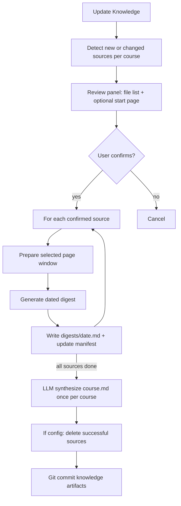

# Arbor: Course-Centric Knowledge & Incremental Ingest — Design

**Date:** 2026-08-12  
**Status:** Approved (design)  
**Category:** Knowledge layout + worker/desktop Update flow (see `PROJECT.md`, `docs/superpowers/specs/2026-08-02-arbor-v1-design.md`, `docs/superpowers/specs/2026-08-06-large-pdf-chunked-generate-design.md`)

## Problem

V1 assumes a rigid layout: one lecture folder → one primary source → one `lecture.md`. Git dirtiness on the source triggers a full reprocess of that lecture.

Real usage is messier. Many users keep one growing mega-file per course (Lecture 1 is 150 slides; later they append Lecture 2 into the same deck → ~300). Others still split per lecture or dump files with little structure. Large sources may also be undesirable to keep in the Knowledge repo after digestion.

Chunked generate (PR #5) improves latency/resume **within one unchanged source hash**. It does not answer “this file grew by 150 pages — only digest the new tail,” and it does not make the **course** the unit of organization.

## Goals

- Treat the **course folder** (e.g. `Biology/`) as the place of truth for knowledge, not individual lecture folders or source files.
- Optimize for growing mega-sources via an explicit **start page** per file (full ingest if unset).
- Persist knowledge as **dated digest markdown files** plus a maintained **`course.md`** rollup.
- Rebuild `course.md` with an **LLM synthesis** after each successful digest batch.
- Allow **delete-after-digest** via config (Settings UI later); default keep sources.
- Keep Knowledge root as the only required container; do not require `Course/Lecture/` taxonomy.

## Non-goals

- Auto-migrating existing V1 `Course/Lecture/lecture.md` libraries (clean break).
- Settings UI for delete-after-digest or start pages (config + Update review panel only for now).
- Automatic page-fingerprint detection of middle-of-deck inserts/edits (user start page is the control).
- Multi-provider, V2 course browser redesign, or flashcards/quiz features.

## Locked decisions

| Decision | Value |
|----------|-------|
| Place of truth | Course folder under Knowledge |
| Sources | Any `.pdf` / `.pptx` under the course (nesting allowed as storage) |
| Pre-Update UI | Review panel of new/changed files; optional start page per file |
| Empty start page | Ingest entire file |
| Start page `N` | Ingest pages/slides `N…end` only (logical clip; do not rewrite master file) |
| Digest artifacts | `digests/YYYY-MM-DD.md` (time/suffix if multiple same day) |
| Course rollup | `course.md` LLM-synthesized from all dated digests after each successful batch |
| Delete sources | Config knob `delete_sources_after_digest` (default `false`); Settings UI later |
| V1 lecture layout | Clean break — not supported |
| Middle edits | Out of scope for auto-detect; user sets start page or re-ingests deliberately |
| Chunked generate | Reused when the selected page window is large |

## Architecture



A **course** is an immediate child directory of the Knowledge root (e.g. `Biology/`, `Chemistry/`). Files and nested folders under a course are storage; they are not separate places of truth.

## Layout

```text
Knowledge/                          # git repo root
  Biology/                          # course = place of truth
    digests/
      2026-08-12.md
      2026-09-01T1430.md            # disambiguated if needed
    course.md                       # LLM rollup
    arbor-course.json               # course manifest (digested sources, windows, fingerprints)
    mega-deck.pptx                  # optional; may be deleted after digest if config says so
    readings/
      chapter.pdf                   # nesting OK; still a source under Biology
  Chemistry/
    ...
  .arbor/
    settings.json                   # includes delete_sources_after_digest
```

Sources are inputs. Dated digests + `course.md` + `arbor-course.json` are the durable knowledge product.

## Update flow

1. User clicks **Update Knowledge**.
2. Worker/desktop discovers **new or changed** sources under each course (git dirty and/or comparison to `arbor-course.json` fingerprints).
3. **Review panel** lists each file with page/slide count and an optional **Start from** field.
4. User edits start pages and **Confirms** (or Cancels with no work).
5. For each confirmed file:
   - Prepare only the selected window (full file if start page empty).
   - Generate digest (chunked generate when the window exceeds the existing chunk threshold).
   - Write `digests/<date>.md`.
   - Update `arbor-course.json` for that source (fingerprint, window, digest path).
6. After the successful digest set for the course changes, **LLM-synthesize `course.md`** from all dated digests in order.
7. If `delete_sources_after_digest` is true, delete sources that fully succeeded in this run.
8. Batch-commit knowledge artifacts (digests, `course.md`, manifest, config-driven deletions).

## Course manifest (`arbor-course.json`)

Committed under the course folder. Answers “have we already digested this content window?” without requiring a sibling `lecture.md`.

Minimum fields (illustrative):

- Per source: relative path, content fingerprint (e.g. file hash), last digested page window (`start`, `end` / `page_count`), digest path(s), timestamps.
- Course-level: last `course.md` synthesis status/error if needed.

Unchanged fingerprint + no new user-requested window → skip in detection.

## Config

Knowledge-root `.arbor/settings.json`:

| Knob | Default | Meaning |
|------|---------|---------|
| `delete_sources_after_digest` | `false` | After successful digest + digest file write, delete that source from disk |

Settings UI later exposes the same knob. Until then, edit this file only.

**Note:** If a mega-file grows and the user leaves start page empty, the entire file is ingested again as a new dated digest. Prefer setting start page to the first new slide to avoid duplicate coverage in `course.md` synthesis.

## Failures and cancel

- One source fails: keep digests already written for other sources; **do not** delete the failed source even if delete-after-digest is on; do not record that source window as done in the manifest.
- Resynthesize `course.md` only when the on-disk digest set successfully changed in this run.
- Cancel is cooperative at source/stage boundaries (same spirit as V1). Finished digests remain; remaining files reappear on the next review panel.

## Relationship to chunked generate

Chunked generate remains the engine for **large page windows**. Incremental course ingest chooses the window (`N…end` or full file); chunking then splits that window for provider calls and intra-run resume. Course-level “what’s already knowledge” is the dated digests + `arbor-course.json`, not `_arbor_cache` alone.

## Clean break from V1

- No dual pipeline for `Course/Lecture/lecture.md`.
- No auto-migration. Users reshape libraries to course folders + sources, or start fresh.
- Root README / desktop guidance must describe the new layout.

## Testing strategy (when implemented)

- Detection: new file, unchanged file, grown file with start page set / unset.
- Review panel: empty start page → full ingest; `N` → only `N…end` prepared/generated.
- Artifacts: dated digest created; `course.md` rewritten via synthesis; manifest updated.
- Delete config on/off; failed source never deleted.
- Cancel preserves completed digests; skipped files remain eligible.
- Large window still emits chunk events from existing chunked generate.

## Implementation sequencing (informative)

1. Course layout + manifest + dated digests (worker).
2. Start-page clipping in prepare/generate.
3. `course.md` LLM synthesis step.
4. Desktop pre-Update review panel.
5. `delete_sources_after_digest` config behavior.
6. Docs replacing V1 lecture-folder guidance.

Exact task breakdown belongs in an implementation plan after this spec is accepted for build.
