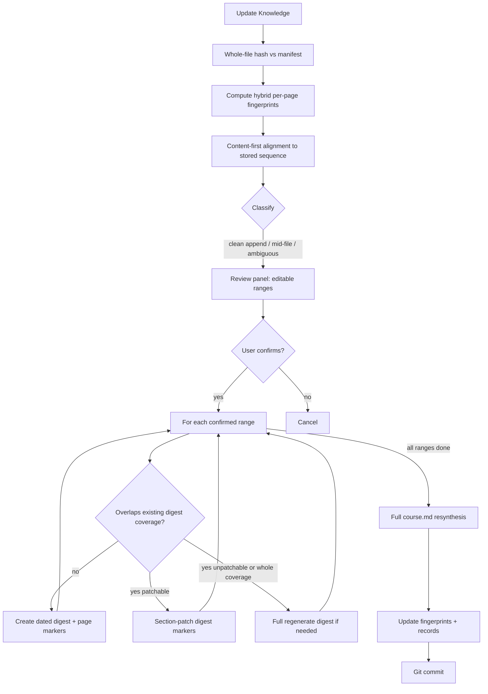

# Arbor: Page Fingerprinting & Surgical Digest Updates — Design

**Date:** 2026-08-12  
**Status:** Approved (design)  
**Category:** Incremental ingest refinement (see `PROJECT.md`, `docs/superpowers/specs/2026-08-12-course-centric-knowledge-design.md`, `docs/superpowers/specs/2026-08-06-large-pdf-chunked-generate-design.md`)

## Problem

Course-centric ingest (PR #7) detects change via a **whole-file hash** and lets the user set an optional **start page**. That works for the common “append lecture 2 onto the mega-deck” case when the user knows the boundary.

It fails when:

- Pages are **inserted or edited in the middle** (page numbers shift; whole-file hash only says “something changed”).
- The user must **guess** ranges; Arbor cannot suggest precise dirty regions.
- Overlapping re-digests would **stack new dated digests** for the same conceptual material, leaving `course.md` synthesis to reconcile duplicates — unless we surgically update existing digests and let **Git** own history.

Delete-after-digest does **not** void fingerprints: hashes live in the committed course manifest, not on the deleted PDF/PPTX.

## Goals

- Detect **which pages/slides changed** using per-page fingerprints stored in `arbor-course.json`.
- **Align** current pages to previously seen fingerprints by **content** (not page number), so mid-file inserts do not cascade false dirty ranges.
- Drive the pre-Update review panel with **explicit page ranges** (not only a single start page).
- On Confirm:
  - **New coverage** → create a new dated digest with mandatory page markers.
  - **Overlap with existing digests** → **section-patch** those digests (full regenerate only when the entire digest coverage changed or patching is impossible).
- Always **full-resynthesize `course.md`** after a successful digest batch for the course.
- Keep fingerprints in the committed manifest so they survive delete-after-digest and machine switches.

## Non-goals

- Production packaging / bundled worker sidecar (separate track: macOS-first, Codex CLI remains external).
- Settings UI for fingerprint or alignment knobs.
- Fully silent Update with no Confirm (clean append still opens review with a pre-selected range).
- Perfect fingerprint accuracy across all exporters (hybrid v1; refinement tracked in a follow-up GitHub issue).
- Windows packaging.
- Page-fingerprint storage only in `_arbor_cache/` (gitignored — would break after delete-after-digest).

## Locked decisions

| Decision | Value |
|----------|-------|
| Architecture | Fingerprints in committed manifest; plan-time align; review → create/patch |
| Platforms (packaging track) | Deferred; when done: macOS first, Codex external |
| Change UX | Clean append → review with new-tail range pre-selected; mid-file → suggested ranges; ambiguous → manual ranges |
| Review selection | Explicit page ranges (e.g. `40-55, 120-122`) |
| New coverage | One dated digest per confirmed range; mandatory page markers |
| Overlap with existing digests | Update existing digest(s) in place; Git tracks versions |
| Patch granularity | Section patch by page markers; full digest regenerate if entire coverage changed or unpatchable |
| Page markers | Mandatory fixed HTML-comment markers in every new/regenerated digest |
| Fingerprint method | Hybrid: PDF → rendered page image hash; PPTX → text hash when rich, image when thin |
| Alignment | Content-first (LCS / equivalent); low confidence → ambiguous (no strong auto-suggest) |
| `course.md` | Always full LLM resynthesis after successful digest add/patch batch |
| Fingerprint durability | Stored in `arbor-course.json` (survives source deletion) |
| Empty ranges in UI | Full-file ingest (same spirit as empty start page today) |

## Approach (selected)

**Fingerprint-in-manifest + plan-time align.**

Rejected alternatives:

- Fingerprints only under `_arbor_cache/` — voided by delete-after-digest / cache wipe.
- Git-diff of binary sources — weak for PDF/PPTX; fails when sources are deleted.

## Architecture



Fingerprinting is **local** (no AI tokens). Tokens are spent only on prepare/generate/patch/synthesis for **confirmed** ranges.

## Manifest schema (`arbor-course.json` v2)

Bump `version` to `2`. Keep existing `records[]` (`DigestRecord`) and add a `sources` map:

```json
{
  "version": 2,
  "records": [],
  "sources": {
    "mega.pdf": {
      "source_hash": "sha256-of-file",
      "page_count": 300,
      "fingerprint_kind": "pdf_image",
      "page_fingerprints": ["abc…", "def…"],
      "updated_at": "ISO-8601"
    }
  }
}
```

| Field | Meaning |
|-------|---------|
| `page_fingerprints[i]` | Fingerprint for page/slide `i+1` |
| `fingerprint_kind` | `pdf_image` \| `pptx_text` \| `pptx_image` |
| `source_hash` | Whole-file hash (fast skip when unchanged) |
| `records[].page_markers_version` | Optional; present when digest was written with mandatory markers |

**v1 migration:** Missing `sources` → no fingerprints; fall back to today’s whole-file + suggested start page (`previous.page_count + 1` when grown). On the next successful fingerprinting Update for a source, write v2 `sources` entry.

## Hybrid fingerprints

| Source | Kind | Method |
|--------|------|--------|
| PDF | `pdf_image` | Hash rendered page image bytes (same render path spirit as prepare) |
| PPTX text-rich | `pptx_text` | Hash normalized extracted slide text |
| PPTX thin text | `pptx_image` | Hash rendered slide image (LibreOffice fallback path when needed) |

Refinement of this hybrid vs uniform image hashing is explicitly deferred to a follow-up GitHub issue (agent token cannot create issues; human opens it from the drafted title/body).

## Alignment rules

1. If stored fingerprints length `N` and first `N` current fingerprints equal stored and `page_count > N` → **clean append**; suggest range `N+1…end`.
2. Else compute content alignment (LCS or equivalent) between stored and current fingerprint sequences.
3. Derive dirty ranges: pages that are new or whose content does not map to an unchanged stored page.
4. **Ambiguous** when matched fraction of old pages `< 0.8` **or** multiple equally good alignments → no strong auto-suggest; user must set ranges.
5. Page numbers are **labels after alignment**, not identity.

## Digest page markers

Mandatory format in every new or regenerated digest:

```markdown
<!-- arbor-pages:40-55 -->
...section content...
<!-- /arbor-pages:40-55 -->
```

- One marker pair per contiguous range stored in that digest file.
- Patcher replaces **inner content only** for the matching range.
- Prompts must require these markers; reject/strip invalid model output missing wrappers.
- Existing digests without markers: first overlapping edit triggers **full regenerate** of that digest (then markers exist forever).

## Per-range processing

After Confirm, for each confirmed range:

1. **Prepare** only that window (reuse clip + chunked generate when large).
2. **Classify vs `records` coverage:**
   - **No overlap** → create new dated digest with markers.
   - **Overlaps one digest** → section-patch matching marker block(s); if the changed range equals that digest’s full coverage → full regenerate that digest.
   - **Overlaps multiple digests** → apply patches to each affected digest for its overlapping sub-range.
3. **Unpatchable** (missing markers, parse failure, invalid model markers) → full regenerate that digest; emit a clear progress event.
4. After all ranges for the course succeed → **full `course.md` resynthesis**.
5. Update `sources[path].page_fingerprints` for **successfully completed ranges’ pages** (do not mark failed ranges done).
6. Commit digests + `course.md` + manifest (+ deletions if configured).

**Cancel:** cooperative at range boundaries. Finished create/patch work remains; remaining ranges reappear on next Update.

## Desktop / plan schema

Extend the review panel beyond a single start page:

- Editable **range list** per pending source (e.g. `151-300` or `40-55, 120-122`).
- Clean append: pre-select `N+1…end`.
- Mid-file: pre-fill suggested dirty ranges.
- Ambiguous: empty/weak suggestions + short note (“alignment uncertain — set ranges”).
- Blank ranges → full-file ingest (escape hatch).
- `plan-update` / `--plan` JSON bumps to carry `ranges: [[start, end], ...]` per source (replacing or superseding single `start_page` for this feature).

## Failures

- One range fails → keep successful ranges; fingerprints updated only for completed work on that source.
- Failed source is never delete-after-digest deleted.
- Patch output without valid markers → treat as unpatchable → full regenerate path or fail the range with a clear error (prefer regenerate once when the digest file exists).

## Testing strategy

- Hybrid fingerprint kinds (PDF image / PPTX text / PPTX thin→image).
- Alignment: clean append, mid insert, mid edit, ambiguous duplicate-heavy deck.
- Plan → ranges → create vs patch vs full regenerate.
- Marker round-trip; missing markers → regenerate.
- Manifest v1 → v2 migration path.
- Delete-after-digest: fingerprints remain; re-adding the same file aligns.
- Desktop: plan payload with ranges; Confirm / Cancel.

## Relationship to prior designs

- **Course-centric:** still the place of truth; this replaces “start page only” as the primary incremental control with fingerprint-suggested **ranges**, while keeping Confirm-in-review.
- **Chunked generate:** still the engine for large windows; fingerprinting chooses the window(s).
- **Delete-after-digest:** unchanged; manifests hold fingerprints.

## Implementation sequencing (informative)

1. Fingerprint helpers + manifest v2 `sources` map.
2. Alignment + plan suggestions (ranges).
3. Digest marker prompts + patch/regenerate apply path.
4. Pipeline wiring + fingerprint update semantics.
5. Desktop review panel ranges + plan schema.
6. Docs + tests + v1 manifest migration coverage.

## Follow-ups

- GitHub issue (human-created): refine hybrid fingerprint strategy after dogfood (false positive/negative rates, mega-deck performance, uniform image hashing, manifest size, PPTX XML hashes).
- Production packaging (macOS-first, Codex external) — separate design.
